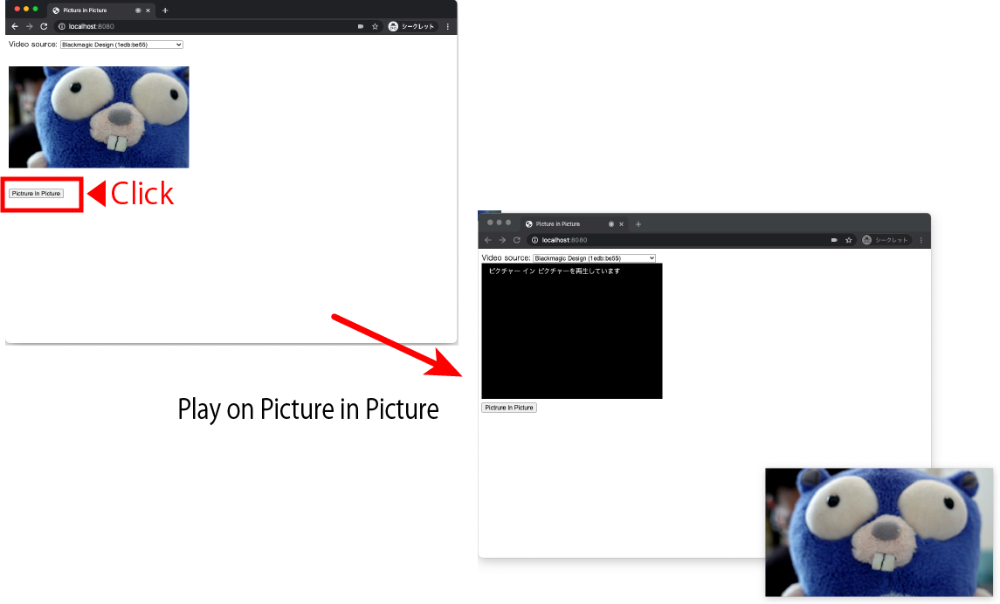

# Picture in Picture



## How to install and use

If you are a gopher, you can install by `go install` (above Go1.16).

```sh
$ go install github.com/push-f/tools/pinp
$ pinp
```

If you are not a gopher, you can run with python's web server.

```sh
$ cd pinp/static
$ python -m http.server 8080
```
